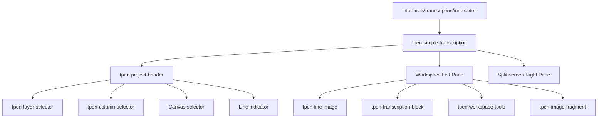
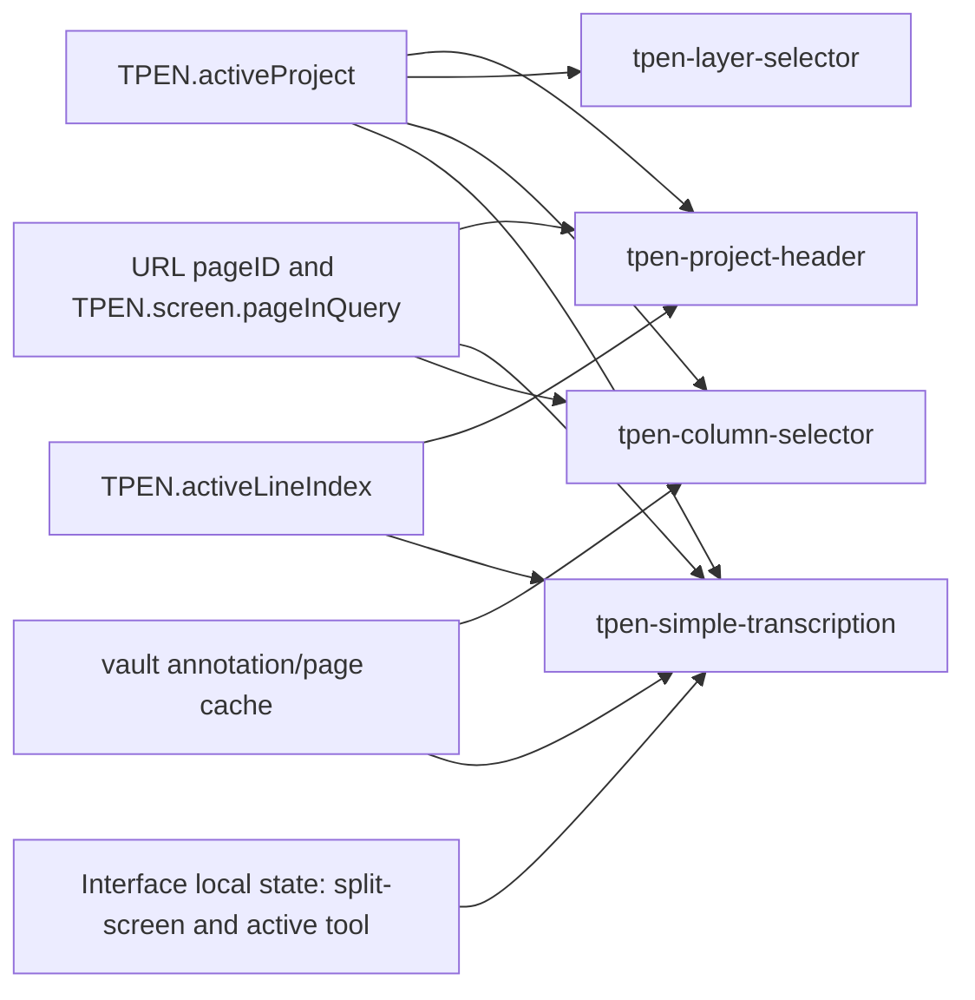
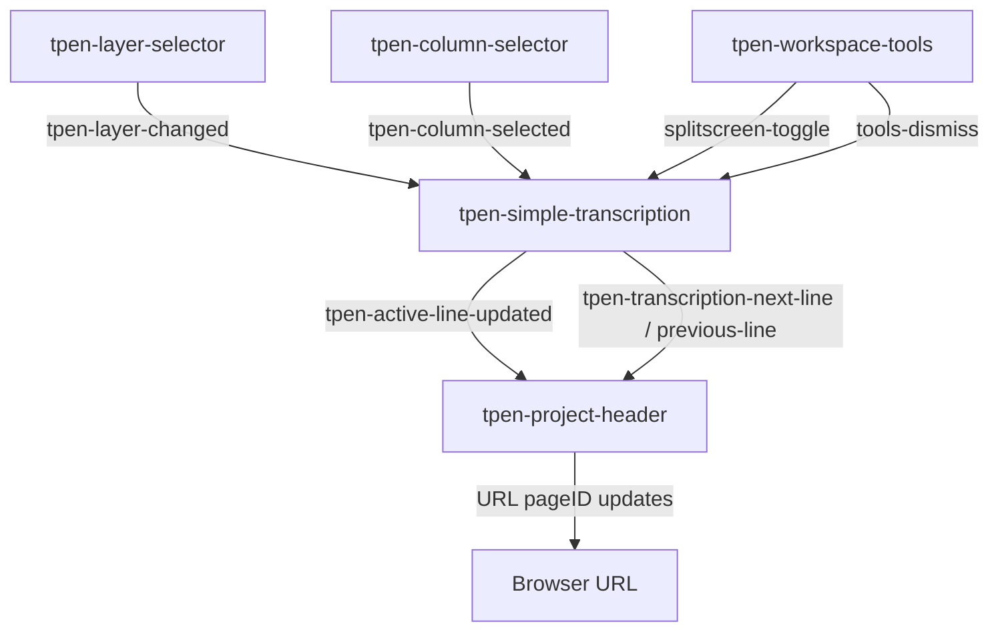

# Transcription Interface Diagrams

This file contains diagram-first references for external linking.

## Composition Diagram

## Data Ownership Diagram

## Event Flow Diagram

## External Link Target

Recommended issue link target:

- components/simple-transcription/ARCHITECTURE.md

Secondary diagram-only link:

- components/simple-transcription/DIAGRAMS.md
